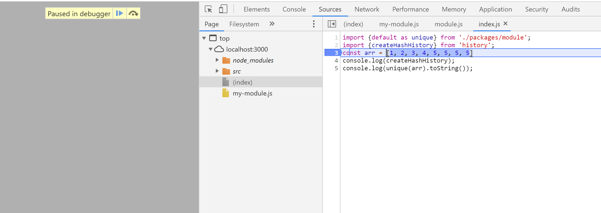

# gulp-demo
调试ES6模块开源库的gulp脚手架
基于项目 [https://github.com/JofunLiang/gulp-translation-es6-demo](gulp-translation-es6-demo)

示例代码:

src/packages/module.js
```js
const unique = arr => [...new Set(arr)];
export default unique;

/*********************************************/

/**  packages/module.js */
// export default {
//   unique: arr => [...new Set(arr)]
// };

/**  index.js */
// import { unique } from "./packages/module";
// 👆这种写法不被支持
// 正确是下面
// import {default as unique} from "./packages/module";


/*********************************************/
```

src/index.js
```js
import {default as unique} from './packages/module';
import {createHashHistory} from 'history';
const arr = [1, 2, 3, 4, 5, 5, 5, 5]
console.log(createHashHistory);
console.log(unique(arr).toString());
```

## 使用
```
npm start
```
另起一个命令行
```
npm run dev
```
浏览器进入[localhost:3000](http://localhost:3000)调试,有sourceMap.



## 打包
```
npm run build
```

根据示例代码打出来的文件my-module.esm.js为
```js
import { createHashHistory } from 'history';

var unique = arr => [...new Set(arr)];
/*********************************************/

/**  packages/module.js */
// export default {
//   unique: arr => [...new Set(arr)]
// };

/**  index.js */
// import { unique } from "./packages/module";
// 👆这种写法不被支持
// 正确是 import {default as unique} from "./packages/module";

/*********************************************/

var arr = [1, 2, 3, 4, 5, 5, 5, 5];
console.log(createHashHistory);
console.log(unique(arr).toString());

```
